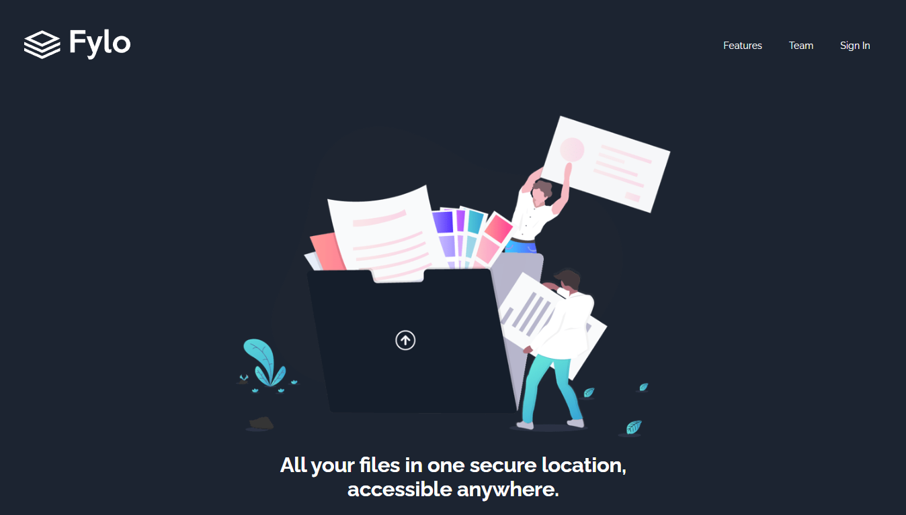

# Fylo Landing Page ✨

A responsive landing page for Fylo, a file storage and sharing platform. This project is a solution to the [Fylo dark theme landing page challenge](https://www.frontendmentor.io/challenges/fylo-dark-theme-landing-page-5ca5f0efec5c34721b71b72a) from Frontend Mentor.

## Overview 📋

Welcome to my solution for the Fylo Landing Page challenge! The goal was to create a landing page that closely matches the provided design. The page should be fully responsive and adapt to different screen sizes. I utilized HTML and CSS to build the layout and styles, and used JavaScript to ensure a user-friendly experience.

## Features 🚀

- 🌐 **Responsive Design** : The landing page is fully responsive, allowing optimal viewing on various devices.
- ✨ **Interactive Elements** : Implemented hover states for all interactive elements to provide feedback to users.
- 🌙 **Dark Theme** : The design features a sleek and modern dark theme, creating an engaging visual experience.
- ✅ **Form Validation** : Implemented client-side form validation to ensure data integrity and enhance user experience.

## Preview 🖥️

## Live Demo 💻

Check out the live demo of the Fylo Landing Page [here](https://flyolandingpage.netlify.app/).

## Technologies Used 🛠️

- HTML5
- CSS3
- JavaScript

## Acknowledgments 💡

I would like to express my gratitude to Frontend Mentor for providing this challenge, which allowed me to enhance my front-end development skills and create this solution.

